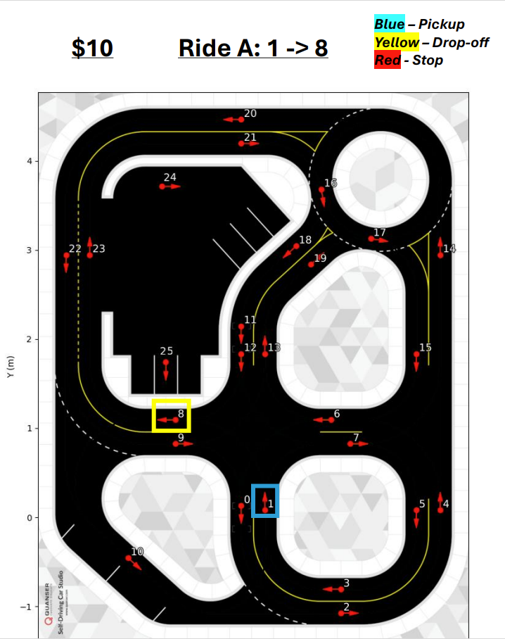
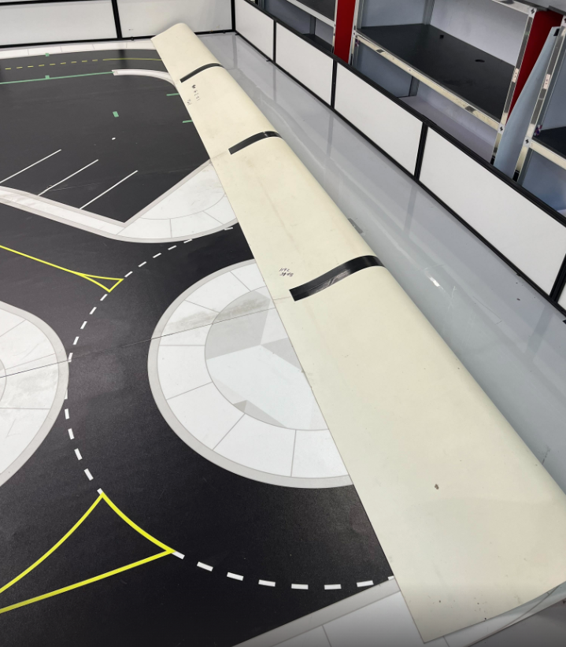
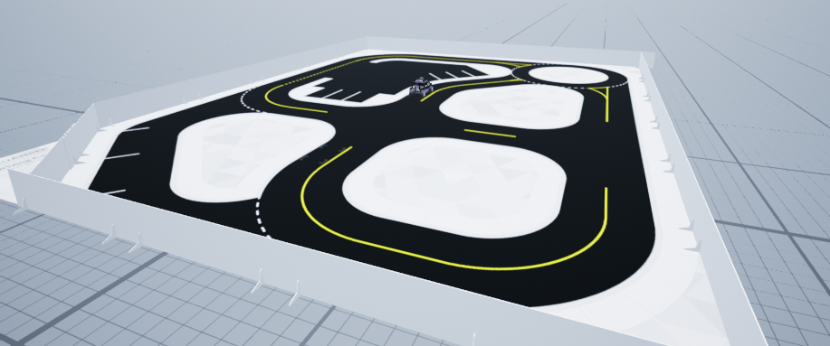

# Physical Stage Competition Organizers Guide 🪧 <!-- omit in toc -->

This document covers the details necessary for a competition organizer to successfully run the physical stage of the competition at a conference/in-person venue. Keep in mind that this document only represents how Quanser has attempted to run the competition and any aspect of this document can be changed to conform to a different competition.

## Topics <!-- omit in toc -->

This document will cover the following:

- [Competition Organizer's Goal for the Physical Stage](#competition-organizers-goal-for-the-physical-stage)
- [Hardware Checklist for the Competition](#hardware-checklist-for-the-competition)
- [General Sequence of Events](#general-sequence-of-events)
- [Quanser's Competition Structure](#quansers-competition-structure)
  - [Preliminary Round](#preliminary-round)
  - [Elimination Round](#elimination-round)
  - [Finals](#finals)
- [Roles and Responsibilities](#roles-and-responsibilities)
  - [Judge](#judge)
  - [Scorer](#scorer)
  - [Scorer's Assistant x 2](#scorers-assistant-x-2)
  - [Arena Assistant x 2](#arena-assistant-x-2)
  - [Announcer](#announcer)
- [Setting Up Traffic Lights](#setting-up-traffic-lights)
- [Communicating to the Audience](#communicating-to-the-audience)
  - [Posterboards](#posterboards)
  - [Projector](#projector)
  - [Handouts](#handouts)
- [Setting Up the Roadmap](#setting-up-the-roadmap)

## Competition Organizer's Goal for the Physical Stage

The goal of the competition organizer in the Physical Stage is to setup an environment that allows the student teams to showcase their self-driving car algorithms in a way that highlights their performance. The competition must be fair and select the best and most capable team as the winner of the competition.

A secondary goal is to ensure an the event is exciting and engaging for spectators. One of the challenges is communicating the rules and objectives to the audience. This is essential for the audience experience and will be covered below in [Communicating to the Audience](#communicating-to-the-audience).

## Hardware Checklist for the Competition

Below is a list of the Quanser hardware needed for the competition:

- 1 x QCar + Accessories (of the same generation) **PER TEAM**
  - Accessories include: batteries, battery charger
- 1 x Large Quanser Roadmap for the competition rounds
- 2 x Clear Gorilla Duct Tape for taping map together
- 1 x SDCS Wall Set
- (optional) 1 Large/Small Quanser Roadmap for teams to practice on
- 1 x Quanser Roadsign Set
- 4 x Quanser Traffic Lights
- 6 x Quanser Traffic Light Batteries
- 1 x Quanser Configured Router (for traffic lights)
- 1 x Laptop w/ Quanser SDK or QUARC

The following list contains additional hardware that may be necessary/useful:

- 1 x Table **PER TEAM**
- 3 x Tables (for the judges)
- 1 x Ethernet Cable per Competition Organizer Laptop
- 1 x Monitor **PER Competition Organizer**
- 1 x Network Switch
- 1 x Microphone
- 10 x Extension Cords
- 10 x Power Bars
- 1 x Tape Measurer
- 1 x TV + TV Stand
- 1 x Projector + Projector Screen
- 1 x Set of Infraction Flags for the Judge (yellow, red, black)
- 1 x Roll of Masking Tape for making markings on the map

## General Sequence of Events

When Quanser runs the competition, there are generally 3 days available at the venue where the environment can be set up, teams can practice and the competition can be run. This usually follows the below timeline:

|   **Day 1**   |     |        |
| :------- |   :-----------:   |   :----------     |
| Morning | Finalize Setup | Set up Quanser Roadmaps, judging tables, practice area, traffic lights, network, ect. |
| Afternoon | Practice | Student teams now have access to practice on the roadmaps and they can ask the competition team questions. The practice is organized into time slots that teams sign up for. |

| **Day 2** |   |   |
| :------- |   :-----------:   |   :----------     |
| Morning | Practice | Teams can continue practicing on the roadmaps. |
| Afternoon | Preliminary Round | A trial round of the competition is run. This will show the organizers if any adjustments need to be made. |
| After Preliminary Round | Practice | Teams may continue practicing. |

| **Day 3** |   |   |
| :------- |   :-----------:   |   :----------     |
| Morning | Practice | Teams continue practicing. |
| Noon  | Elimination Round | Another round of the competition is run, but this time scores will determine the top 3 teams to move on. |
| Afternoon | Finals | The top 3 teams compete in the final round of the competition to determine the winner. |
| After Finals | Award Ceremony | The judges will tally the scores and the announcer will release the results. |
| After Award Ceremony | Teardown | All competition materials will be packed up and put in the appropriate spot. |

Specific timelines will depend on how long the venue is open until. Quanser pushes the organizers of the competition to leave the venue open as late as possible to give the teams as long as possible to develop and test.

## Quanser's Competition Structure

When Quanser runs the competition there are three rounds:

### Preliminary Round

 This round does not eliminate anyone. It is intended to be a trial run for how the competition functions. The organizers should take this as an opportunity to discover if they need to adjust any rules or roles.

 In this phase all of the teams are still ranked and the order determines who will go first during the elimination round. The worse that a team does in the preliminary round, the sooner they go in the elimination round. This is intended to give a slight incentive for teams to try hard during the preliminary round.

### Elimination Round

 Any rule adjustments should be communicated to the teams before beginning this round. This round will function the same as the preliminary round, but ONLY the top 3 teams will move on.

### Finals

 ONLY the top 3 teams will compete against each other and a final winner will be determined.

## Roles and Responsibilities

Different roles and responsibilities need to be defined before the competition starts to ensure a smooth execution of the competition.

### Judge

 The judge will be inside of the arena and will be determining infractions while a team is performing their run. The judge must understand the following:

- All of the different infractions mentioned in the [Physical Stage Competition Guide](../Rules_and_Objectives/Physical_Stage_Competition_Guide.md#ride-ratings)

- There will be some leniency when determining infractions, but try to be consistent (whatever decision is made in the moment cannot be changed)

- Must know how the sequence of a ride works ([Physical Stage Detailed Objective](../Rules_and_Objectives/Physical_Stage_Competition_Guide.md#physical-stage-detailed-objective))

 Quanser uses a flag system for the judge to communicate infractions to the Scorer. The system is as follows:

- Yellow flag: 1 star infraction
- Red flag: 2 star infraction
- Black flag: disqualifying infraction

Additionally, the judge should call out the infraction that they see for further communication.

### Scorer

 The scorer will be responsible for recording the following:

- What team is currently active?
- What ride number/letter they are attempting?
- Any infractions received on this ride
- Was the ride completed?

 The scorer will need to develop a robust system to record all of the above information. They also need to be listening to the Judge for the infractions that get called out.

 The Scorer will also lean on their assistants to be watching and relaying infraction and ride information to them.

 The Scorer will need to understand the following:

- All of the different infractions mentioned in the [Physical Stage Competition Guide](../Rules_and_Objectives/Physical_Stage_Competition_Guide.md#ride-ratings)

- Must know how the sequence of a ride works ([Physical Stage Detailed Objective](../Rules_and_Objectives/Physical_Stage_Competition_Guide.md#physical-stage-detailed-objective))

### Scorer's Assistant x 2

 Scorer's Assistants will be watching the competition as if they were scorers, but will not be recording any information. They will need to keep a mental note of recent events and be able to communicate that information to the Scorer in case the Scorer missed anything. It is best if there are two assistants in case anybody misses anything.

 They will need to understand everything the Scorer does about the competition.

### Arena Assistant x 2

 Two Arena Assistants will be entering the arena with the following responsibilities:

- Replace any walls that get moved if a QCar crashes into them
- Move markers around that indicate what ride is being attempted
  - This is optional, but placing markers helps communicate to the audience and Judge where the QCar is supposed to be travelling
- Reposition traffic lights and road signs if they get moved

The Arena Assistants will need to have knowledge of the following:

- Must know how the sequence of a ride works ([Physical Stage Detailed Objective](../Rules_and_Objectives/Physical_Stage_Competition_Guide.md#physical-stage-detailed-objective))

### Announcer

 The Announcer is essential for communicating what is happening to the audience. They are also important for promoting and spreading awareness for how hard the student teams are working. One of the reasons teams participate in competitions is to gain renown for their university. The announcer should prepare some details about each of the teams that they can mention during the rounds.

 The announcer has no specific responsibilities, but should have knowledge about the following:

- All of the different infractions mentioned in the [Physical Stage Competition Guide](../Rules_and_Objectives/Physical_Stage_Competition_Guide.md#ride-ratings)

- Must know how the sequence of a ride works ([Physical Stage Detailed Objective](../Rules_and_Objectives/Physical_Stage_Competition_Guide.md#physical-stage-detailed-objective))

- Team details (it helps if the announcer talks to the teams)

## Setting Up Traffic Lights

To set up an intersection with a 4 way traffic light, please refer to the following document within the resources: [Setting Up a Traffic Light Intersection](./traffic_light_setup/Traffic_Light_Intersection_Setup_Guide.md)

## Communicating to the Audience

It can be difficult to communicate to the audience what is going on since the rule set and task given are quite complex. The easiest way to communicate to the audience is through the Announcer. It is important the announcer has a good understanding of the competition as a whole so that they can talk about relevant points during the rounds (when they are announcing). Some important tools can be included to help communicate further to the audience and help attract spectators:

### Posterboards

 There are multiple different posterboards that can be created to communicate information to the audience. A few are listed below:

 - To make the topic of the competition clear to the audience, it could be useful to print an short description of the competition. There is one provided at the top of the [Physical Stage Detailed Objective](../Rules_and_Objectives/Physical_Stage_Competition_Guide.md#physical-stage-detailed-objective).

 - To make the ruleset visible to passersby, it could be useful to print the objective of the competition. This is in the [Physical Stage Detailed Objective](../Rules_and_Objectives/Physical_Stage_Competition_Guide.md#physical-stage-detailed-objective).

### Projector

 Quanser utilized a projector that displayed the current ride that a team was attempting. There was a Powerpoint slide containing the Quanser roadmap where the pickup, dropoff, and stop locations were marked:

 

### Handouts

 Handouts can be given out by a volunteers to the audience that contain the information that is on the Posterboards or other graphics.

## Setting Up the Roadmap

There is a temporary setup for the Quanser Roadmap using clear gorilla duct tape that Quanser recommends when setting up a map for the competition. Please follow the steps below:

1. Lay the sections of the roadmap down in the correct order with the map side facing up
2. Tape the map with the with the clear gorilla tape along the whole seam
   - This usually takes 2 rolls

**If you do not have clear tape that is strong**, you will need to do the following:

1. Lay the sections of the roadmap face down in the correct order
2. Tape the map along the whole length of the seam with strong tape
3. Flip the map over pulling parallel to the seam as shown here:

  

Once the map is set up, the walls should be placed around the map as shown here:

  

After the walls are set up, different traffic scenarios can be created using the various SDCS accessories such as the traffic lights, stop signs, yield signs, roundabout signs, ect.

Here is one way of setting up the map :

  