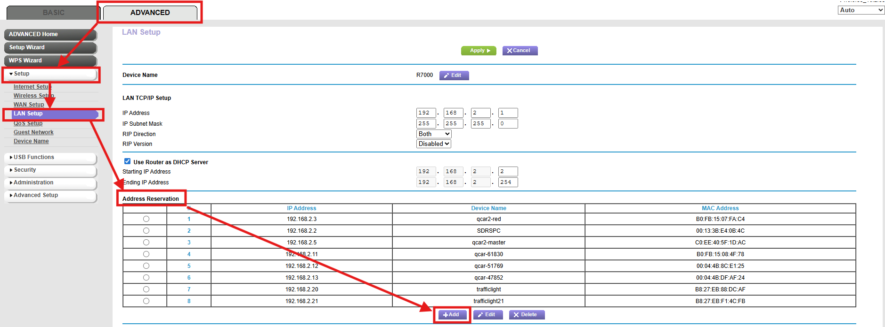
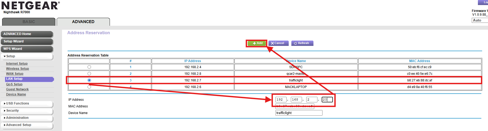
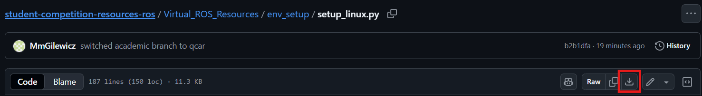

# Traffic Light Intersection Setup Guide 🪧 <!-- omit in toc -->

This document covers how to setup a 4-way intersection on the Quanser Large Roadmap and some tips and tricks that may help with traffic lights throughout the competition.

## Topics <!-- omit in toc -->

This document contains the following:

- [Existing Documentation](#existing-documentation)
- [How to Set the Static IP for a Quanser Traffic Light](#how-to-set-the-static-ip-for-a-quanser-traffic-light)
- [Setting Up a 4-Way Intersection](#setting-up-a-4-way-intersection)
- [Testing an Individual Traffic Light](#testing-an-individual-traffic-light)

## Existing Documentation

The Quanser Academic Resources Github contains important information about using the Quanser Traffic Lights:

- [Traffic Light User Manual](https://github.com/quanser/Quanser_Academic_Resources/blob/dev-windows/3_user_manuals/traffic_light/user_manual_traffic_light.pdf)
- [Traffic Light Example Code](https://github.com/quanser/Quanser_Academic_Resources/tree/dev-windows/5_research/sdcs/traffic_light)

The user manual should be read for information on how to connect to the traffic lights and operate them.

## How to Set the Static IP for a Quanser Traffic Light

This guide assumes you are using the Quanser Router or a router that is broadcasting the SSID: Quanser_UVS. If you do not use this SSID, the router will not connect.

Setting a static IP Address for the traffic lights is useful for the competition because you do not need to check the IP Address of the traffic light every time it is booted. This will make swapping the battery much easier since you know what the IP Address will be once the Traffic Lights boot up. Follow the below steps to change the IP Addresses:

1. Ensure only 1 traffic light is powered on (this makes it easier to identify and set the IP Addresses)

2. Ensure the router is on and your computer is connected to the router (ethernet connection is better)

3. Connect to the router via a browser by entering the IP Address: 192.168.2.1

4. Log into the router
   - For a Quanser Router the following is relevant:
   - Username: admin
   - Password: Quanser_123

5. Go into the `ADVANCED` tab, then `Setup` -> `LAN Setup`

6. Under `Address Reservation` select `Add`

    

7. Select the traffic light in the `Address Reservation Table`, change the IP Address to 192.168.2.20 and click `Add`

    

8. You should see the traffic light in the `Address Reservation` list

9. Click `Apply` at the top of the page

10. Label the traffic light with the IP Address IMMEDIATELYa

Repeat this process for the other traffic lights using the IP Addresses:

- 192.168.2.21
- 192.168.2.22
- 192.168.2.23

## Setting Up a 4-Way Intersection

To set up a 4-way intersection, make sure you have set the static IP Addresses. Then do the following:

1. Ensure you have [downloaded the Quanser Academic Resources](https://github.com/quanser/Quanser_Academic_Resources?tab=readme-ov-file#downloading-resources) and [setup your computer for using Python](https://github.com/quanser/Quanser_Academic_Resources/blob/dev-windows/docs/pc_setup.md#if-you-are-using-python)

2. Download the [4 Way Intersection Python Script](./4wayIntersectionAsync.py) manually

    

3. Ensure the Traffic Lights are on

4. Run the Python script

## Testing an Individual Traffic Light

To test a single traffic light do the following:

1. Ensure you have downloaded the [Single Traffic Light Tester](./SingleLightTrafficLightTester.py) code
2. Ensure the traffic light is on
3. Change the IP Address to that of the traffic light in the script
4. Run the Python Script