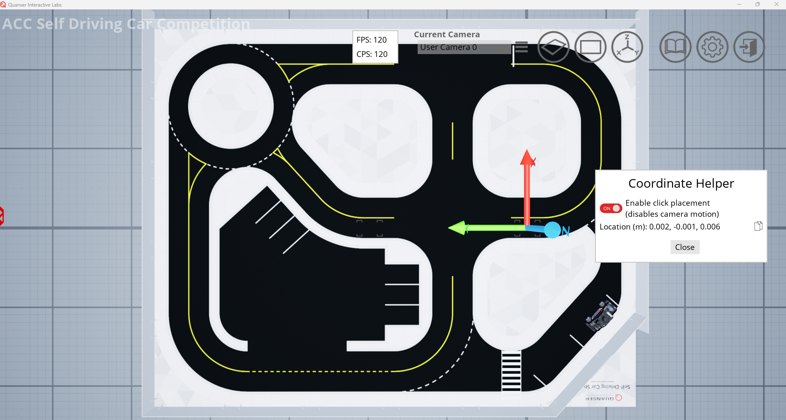

# Physical Stage Competition Guide 🪧 <!-- omit in toc -->

Welcome to the physical stage of the competition. Teams will implement their self-driving algorithm on the physical QCar and compete live!

This document contains the following topics:

- [Physical Stage Detailed Objective](#physical-stage-detailed-objective)
- [Ride Ratings](#ride-ratings)
- [Scoring System](#scoring-system)
- [Coordinate System](#coordinate-system)
- [Competition Day Details](#competition-day-details)

## Physical Stage Detailed Objective

The objective of the competition will be to maximize the amount of money earned by completing taxi rides within a certain amount of time. All teams will be given a file that contains coordinates and ride details on the day of the competition. Rides can have multiple stops, which will add complexity. Teams will earn more money for more complex rides.

The first coordinate in a ride will always be the Pickup location. Teams must indicate a pickup by changing the QCar 2 LED strip to <span style="color: blue;"> Blue </span> and come to a full stop at the pick up.

The last coordinate in a ride will always be the Drop Off location. Teams must indicate a drop off by changing the QCar 2 LED strip to <span style="color: orange;"> Orange </span> and come to a full stop at the drop off location.

Any coordinates in a ride that aren’t the first and last coordinates will be a Stop. Teams must indicate a stop by changing the QCar 2 LED strip to <span style="color: red;"> Red </span> and come to a full stop at the stop location.

When driving between coordinates, teams must change their LED strip to <span style="color: green;"> Green </span>.

The sequence of a single ride will consist of the following:

1. The QCar 2 will start in the Taxi Hub Area with <span style="color: red;"> Red </span> LEDs.

2. Teams will need to write down (or call out) the ride number they are attempting and show the judges.

3. Once a team receives confirmation from the judges, they can begin the ride.

4. Teams will need to navigate to the pickup location.

5. Once the QCar 2 has arrived at the pickup location, it must change the onboard LED strip to <span style="color: blue;"> Blue </span> and come to a full stop.

6. If there are any stops in the ride, teams will need to navigate to the stop location, change the LED strip to <span style="color: red;"> Red</span>, and come to a full stop.

7. For the final coordinate, teams will need to navigate to the drop off location, change the LED strip to <span style="color: orange;"> orange</span>, and come to a full stop.

8. Once the drop off has been completed, teams will need to navigate back to the Taxi Hub Area and change their LEDs to <span style="color: red;"> Red </span> to signal the end of the ride.

Once all the above steps have been completed, the judges will mark down the successful completion of a ride. The team will receive a preset dollar amount for the completion of the ride. The team will also receive a rating for the ride based on whether they followed traffic laws correctly. Infractions will lower the rating the team receives. Please refer to the Ratings section for details.

If the team feels they want to restart the ride or they think they have received too many infractions, they can pick up their QCar 2 and place it back in the Taxi Hub Area. Any time a team touches their QCar 2, it will disqualify that ride, and they must place it back in the Taxi Hub Area.

A ride may be completed multiple times, but only the best rating for that ride will contribute to the final score.

## Ride Ratings

Ratings will be given after every ride completion. The ride rating will be out of 5 stars. All rides will start with a 5-star rating and stars will be deducted based on the following table:

| Infraction   | Description                         | Star Deduction   |
|:-------------|:------------------------------------| :--------------: |
| Minor Lane Departure | Drives over line/sidewalk for less than 3 seconds and by less than approximately 1 car width  | 1 |
| Major Lane Departure | Drives over line/sidewalk for 3-6 seconds and by less than approximately 1 car width | 2 |
| Disqualifying Lane Departure | Drives over line/sidewalk for more than 6 seconds or by more than 1 car width | 5 |
| Does not full stop at a stop sign | Wheels do not come to a full stop at the stop sign | 2 |
| Does not stop at a stop sign | Does not slow down or minimally slows down for the stop sign | 2 |
| Stops over the white line for a stop sign | Front wheels are on or in front of the white line | 1 |
| Stops over the white line or in a cross walk for the traffic lights | Front wheels are on or in front of the white line or the front wheels are in the crosswalk | 1 |
| Does not stop at a traffic light | Goes through a red light | 2 |
| Cone Collision | Collides with a cone | 2 |
| Obstacle Collision | Collides with an object that is not a cone | 5 |
| Failure to yield | Fails to yield at a yield sign when the car doesn’t have the right of way | 2 |
| Incorrect QCar 2 LED Strip colour (per infraction) | Fails to change QCar 2 LED strip to the correct colours laid out in the Stage 3 Objective section | 1 |
| Failure to stop in the correct area for a pick-up, stop, or drop-off | A mark zone will show where the stopping locations are for a pick-up, stop, and drop-off. Failure to stop within that zone is a penalty | 1 |
| | | |

**Disclaimer**: This list contains the most likely infractions, but this list could be added to in the future or during the competition. The judges will notify teams if there is an addition to the list during the competition.

For timings, approximate distances and speeds, judges will be using their discretion. All decisions made by the judges in the moment will be final unless overruled by another judge. Please respect their decisions.

## Scoring System

The scoring will consist of 2 parts, the value of the ride and the rating received for the ride. Each ride will have a dollar value associated with it depending on the complexity. This dollar value will be multiplied by the number of stars received in the rating for the ride.

**Formula**:

```math
Ride Value * Rating = Total Money Earned
```

Here is an example of the scoring for a few completed rides:

<center>

| Ride#     | Ride Value    | Rating (Stars)    | Total Money Earned    |
|:-------:  |:-----:        | :--------:        | :------------------:  |
| 1         | $3            | 3                 | $9                    |
| 4         | $2            | 5                 | $10                   |
| 10        | $3            | 4.5               | $13.50                |
| 8         | $5            | 0                 | $0                    |

</center>

The judges will be keeping track of the completed rides and the rating received for that ride.

## Coordinate System

Throughout the competition the following coordinate system will be used. The same coordinate system will be used for both the virtual and physical portions of the competition since QLabs contains 1:1 representations of the Quanser Roadmaps.

[0,0,0] and the orientation of the coordinate tool in QLabs will define the base frame that all coordinates are determined from.



Figure 2: Base Frame of the Coordinate System in the Competition Roadmap

## Competition Day Details

Please see the following guide for a list of things needed for the physical competition:

[Compeitition Day Guide](./Physical_Stage_Competition_Day_Guide.md)
