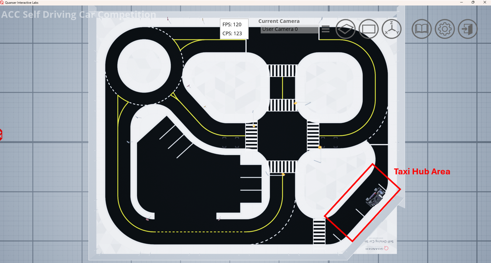
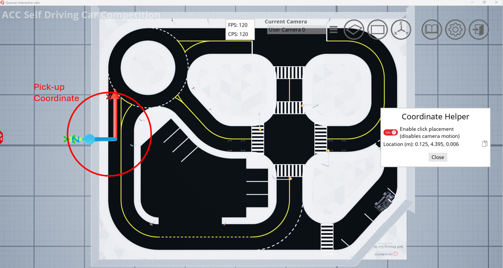
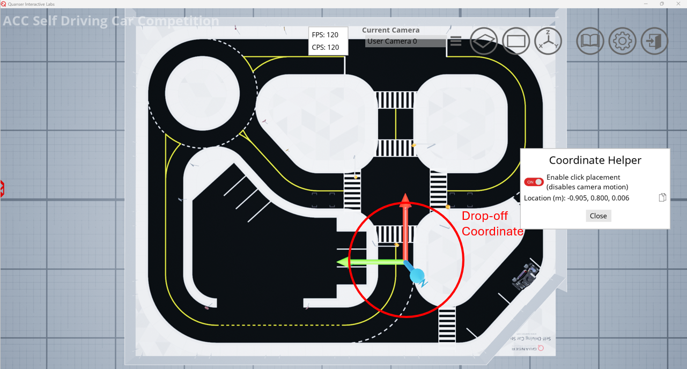

# Detailed Scenario <!-- omit in toc -->

The detailed scenario is represented in [this video](https://youtu.be/NtgBwlfGbMc).

Below is a step-by-step sequence of events that are representative of what will be tested during Physical Stage of the competition. It is still expected that teams communicate important aspects of their algorithm throughout their video submission.

## Scenario

1. Run the `Setup_Real_Scenario` ([.py](../Virtual_ROS_Resources/env_setup/docker_resources/quanser_docker/python/Base_Scenarios_Python/Setup_Real_Scenario.py)/[.m](../Virtual_MATLAB_Resources/self_driving_stack_resources/Setup_Real_Scenario.m)) file. This will spawn the QCar 2 in the Taxi Hub Area:

    

2. Change the LED strip on the QCar to  Magenta .

3. Change the LEDs to  Green  and navigate to the pick-up coordinate [0.125, 4.395] (meters):

    

4. Come to a full stop and change the LED strip to  Blue  to indicate a passenger pick up.

5. Navigate to the drop-off coordinate [-0.905, 0.800] (meters):

    

6. Come to a full stop and change the LED strip to  orange to indicate a passenger drop off.

7. Navigate back to the Taxi Hub Area and change the LED strip to  Magenta  to await another ride.

**END OF SCENARIO**

## Coordinate System

Throughout the competition the following coordinate system will be used. The same coordinate system will be used for both the virtual and physical portions of the competition since QLabs contains 1:1 representations of the Quanser Roadmaps.

[0,0,0] and the orientation of the coordinate tool in QLabs will define the base frame that all coordinates are determined from.

Figure 2: Base Frame of the Coordinate System in the Competition Roadmap.

## Expectatations

When the judges are viewing the video submissions, they will be watching for the following, but not limited to:

1. Cars crossing over lane lines.

2. Cars not fully stopping at traffic controls.

3. Timely reactions to traffic controls.

4. Properly stopping to pick-up and drop-off passengers.

5. Avoiding any obstacles.

6. Moving as fast as possible (moving as fast as possible will be important for the physical stage if applicable).

7. Changing to the correct LED colours.

It is important to keep in mind that this scenario only represents a single "ride". The physical stage will require you to complete as many rides as possible in a certain time period.

Teams are also expected to not use the `qvl` library to move or gather information from the QCar 2. Doing so will **invalidate** a submission.
